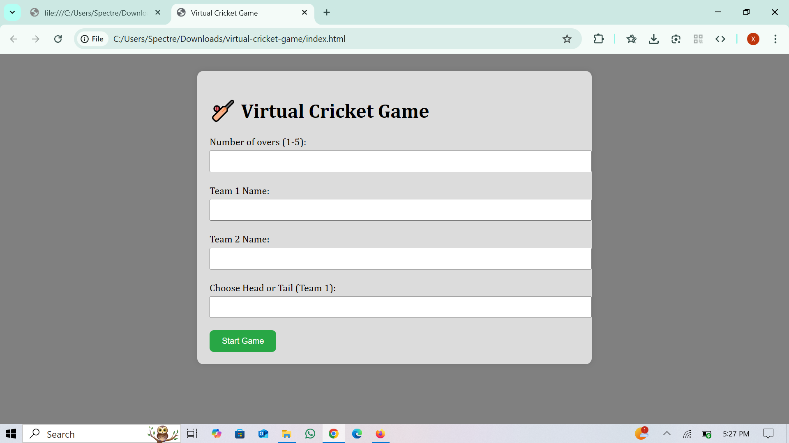

#  🏏 Mini Cricket Game – Web Edition

A lightweight, browser-based **2-team cricket match simulator**. Built using **HTML, CSS, and JavaScript**, this game brings back the feel of classic hand cricket in a simple, stylish UI.

## 🎮 Features

- 🧢 Toss (Head/Tail) with user input
- ⚾ Choose number of overs (1–5)
- 🏏 Two teams compete in a one-wicket game
- 📈 Real-time over-by-over score display
- 🎯 Match result logic with target chase
- 💻 Responsive and clean UI (no frameworks!)

## 📸 Preview

## 🚀 How to Play

1. Clone or download the repository.
2. Open `index.html` in your browser.
3. Enter:
   - Number of overs
   - Team names
   - Toss choice and decision
4. Watch the game unfold automatically with live score updates.

## 🛠️ Built With

- HTML5
- CSS3
- JavaScript (Vanilla)

## 💡 Why This Project?

This project started as a passion for cricket and coding — a simple way to simulate match scenarios while learning and practicing DOM manipulation and JavaScript logic.

---

⭐ Star the repo if you liked it. Contributions and ideas for new features are always welcome!

